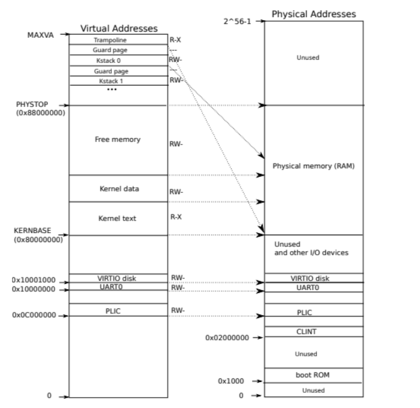
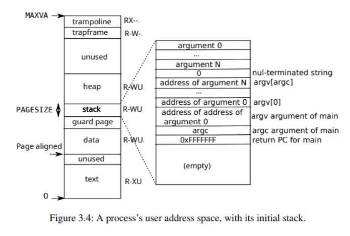

# 存储管理

## 全局分配器
为了在内核中能够使用 `String`, `Vec` 等动态内存分配的容器，需要实现 `global_allocator`，为此我们直接使用的现有的 `buddy_system_allocator` 来实现。
```rust
#[global_allocator]
static HEAP_ALLOCATOR: LockedHeap = LockedHeap::empty();
```

## 物理页分配
我们对空闲页面的管理方式和 xv6 相同，即链式管理。由于链表的所有结点信息都存储在空闲页面里面，所以这种管理方式的优点就是**没有额外的内存开销**。

在内核初始化时，会扫描所有的空闲物理页面，然后组成一个空闲页面链表。
```rust
struct Kmem {
    lock: Spinlock,
    freelist: *mut Run,
}

pub fn kinit() {
    KMEM.get_mut().freerange(ekernel as Addr, PHYSTOP);
    // println!("kinit success!");
}
fn freerange(&mut self, pa_start: Addr, pa_end: Addr) {
    let mut pa = pgroundup(pa_start);
    while pa < pa_end - PGSIZE {
        self.kfree(pa);
        pa += PGSIZE;
    }
}
```

`kalloc()` 会从单向空闲页面链表的表头，找到一个可用的空闲页面，如果找到就返回这个地址，否则就会返回一个空指针。

`kfree()` 会回收一个地址为 `pa` 的物理页面。

```rust
fn kfree(&mut self, pa: Addr) {
    if pa % PGSIZE != 0 || pa < ekernel as Addr || pa >= PHYSTOP {
        panic!("kfree");
    }

    // 填充垃圾数据避免垂悬引用
    memset(pa as *mut u8, 1, PGSIZE);

    let pa = pa as *mut Run;
    self.lock.acquire();
    unsafe { (*pa).next = self.freelist }
    self.freelist = pa;
    self.lock.release();
}

fn kalloc(&mut self) -> Addr {
    let mut r: *mut Run = null_mut();

    self.lock.acquire();
    r = self.freelist;
    if r != null_mut() {
        unsafe { self.freelist = (*r).next }
    }
    self.lock.release();

    if r != null_mut() {
        memset(r as *mut u8, 5, PGSIZE);
    }

    r as Addr
}
```
当然目前的这种单向链表管理方式也存在一些问题：
- 没必要在初始化时扫描所有内存，而仅需额外增加一个变量 next 表示下次分配的物理页面的地址，在释放页面时才逐步地建立起来空闲页面链表。
- 单向空闲页面链表会存在**部分页面频繁使用，而部分页面几乎从不使用**的情况，可以使用双向链表改进。

后续会对上述存在的问题进行改进。

## 虚拟存储
我们虚拟存储的实现基本与 xv6 保持一致。

对于内核地址空间，我们采用恒等映射的方式。



对于用户地址空间，我们将其映射到地址 0x0 处。



## 内核栈与用户栈
在实际运行测试过程发现一个页面大小的堆栈无法满足正常需求，有时在内核启动过程中会出现爆栈的情况，所以我们统一将内核的堆栈大小设置为 16 个页面，也就是 64K，而用户的堆栈大小设置为 4个页面，即 4K。
```rust
pub const KERNEL_STACK_SIZE: usize = 16 * PGSIZE;
pub const USER_STACK_SIZE: usize = 4 * PGSIZE;
```